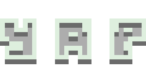
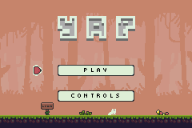
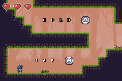
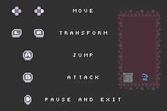
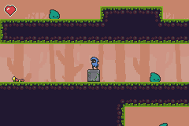

<h2 align="center"> Yet Another Platformer </h2>  

    

***

  "Yet Another Plaformer" is a small platform game developed for the Game Boy Advance.

 

## Table of Contents

- [Media](#media)
- [Build Process](#build-process)
- [Assets](#assets)
- [Changes made to original work](#changes-made-to-original-work)
- [To-Do](#to-do)
 

## Media

    
  

    
  

 

## Build Process
While the project does not make use of the libraries provided by devkitPro, it does use some of the tools included. The first step is to download and install the toolchain following the instructions at [devkitpro.org/wiki/Getting_Started](https://devkitpro.org/wiki/Getting_Started). The package you are looking for is ``gba-dev``. Once the package is installed, navigate torwards the root of the project and run ``make``.

 

## Assets
- Music by <b>Goose Ninja</b>. Check out [Minimalistic Loops](https://gooseninja.itch.io/minimalistc-loops) in [hist itch.io page](https://www.itch.io).
- Sprites by <b>o_lobster</b>. Check out [PIXEL ART METROIDVANIA ASSET PACK](https://o-lobster.itch.io/platformmetroidvania-pixel-art-asset-pack), licensed under the [Attribution 4.0 International (CC BY 4.0)](https://creativecommons.org/licenses/by/4.0/), in [his itch.io page](https://o-lobster.itch.io/).
- Buttons by <b>zrghr</b>. Check out [Buttons](https://zrghr.itch.io/the-buttons) in [his itch.io page](https://zrghr.itch.io/).
- Font by <b>Impossible Realms</b>. Check out his [8x8 Font](https://opengameart.org/content/8x8-font-chomps-wacky-worlds-beta) and his [other work](https://opengameart.org/users/impossiblerealms).

 

## Changes made to original work
The main character of the game, designed by <b>o_lobster</b>, was blue in it's original form. In this project, a different palette has been used to create an alternate yellow version of the character.

 

## To-Do
- [ ] Improve player movement.
- [ ] Improve collisions.
- [ ] Add more sound effects.
- [ ] More characters to choose from.
- [ ] More enemies.
